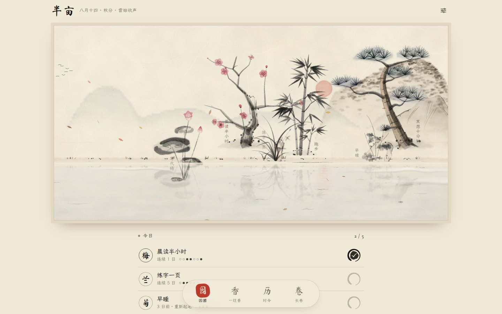
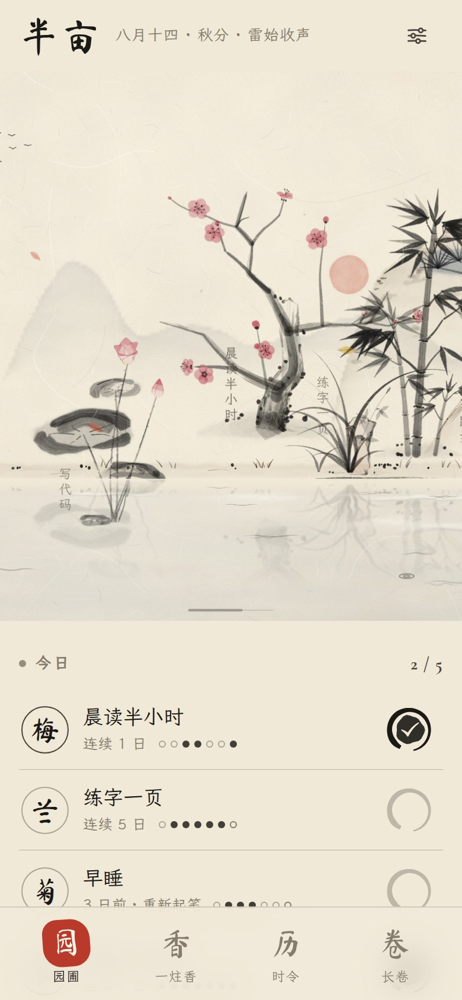
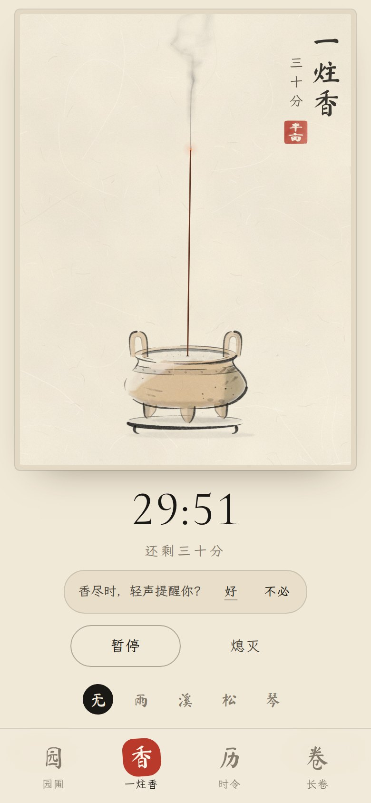
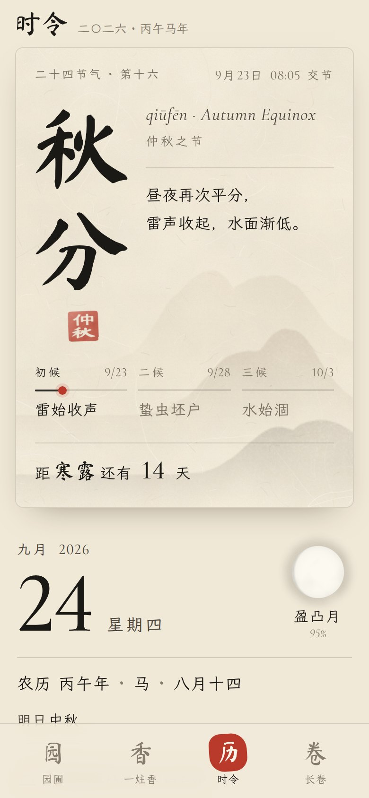
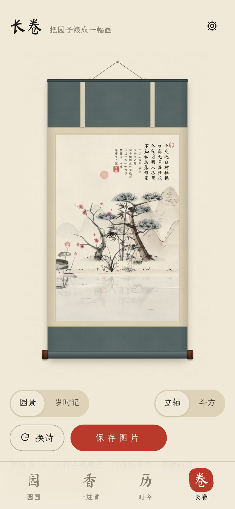

# 半亩 · Half-Acre

> 半亩方塘一鉴开，天光云影共徘徊。
> 问渠那得清如许？为有源头活水来。
> — 朱熹《观书有感》

**A habit garden painted in Chinese ink.** Every habit you keep is a plant from literati painting:
梅 plum, 兰 orchid, 竹 bamboo, 菊 chrysanthemum, 松 pine or 荷 lotus. Each day you do the habit,
the brush adds a few strokes and the plant grows. The pond in front of the garden reflects the sky
only as clearly as your habits stay fresh. Zhu Xi asked how a half-acre pond stays so clear. His
answer was fresh water flowing in from the source, and habits work the same way.

**一个用水墨画出来的习惯花园。** 每个习惯是一株文人画里的植物，每坚持一天，笔墨就多添几笔。
园前那方池塘映出的天光云影，随你的习惯是否"活"而清浊。问渠那得清如许？为有源头活水来。

<p align="center">
  
</p>

<p align="center">
  
  
  
  
</p>

## What's inside · 功能

**园 Garden.** Each habit grows as a plant. A new habit starts as a sprout; around day 66, the
average time it takes to form a habit, it reaches full bloom. Check in by tapping the ensō: the
new strokes are brushed in, petals drift, and a line of classical poetry appears in the sky. You
also get streaks and a 16-week ink-dot history, and you can tap a past day there to fill it in.
Habits can run on chosen weekdays, and there is a one-line note for each day and an archive.
A neglected plant turns pale and dry, but it never dies. The painting follows the real sky:
dawn, dusk, night with the moon in its actual phase, and weather for the season. That means
falling petals in spring, fireflies in summer, geese and falling leaves in autumn, and snow in
winter. With many habits the garden becomes a hand scroll you can pan.

**香 Focus.** 一炷香, "one stick of incense", is an old unit of time, and here it is a focus timer.
A bronze censer holds a burning stick, and you can stir its smoke with your finger. Pick 15, 30,
45 or 60 minutes, or your own length. You can write down what the incense is for, and you can
**tie it to a habit**: when the stick burns all the way through, that habit is marked done. You
can add rain, a stream, wind in the pines or a generative guqin while it burns. Pause, resume or
put it out early; a burning stick survives reloads. A week of incense is shown as painted sticks.

**历 Almanac.** It shows the lunar calendar (农历, 1900–2100), the 24 solar terms computed from
the sun's position, the 72 pentads (七十二候), traditional festivals, the moon phase, and sunrise
and sunset for your location. There is also a month grid, a year wheel of the solar terms, a poem
for the season, and a playful modern 宜/忌.

**卷 Scroll.** It mounts your garden as a hanging scroll (立轴) or a square panel (斗方). The poem
inscription is placed in empty sky, and the date and your record are written in classical
phrasing, followed by your own seal. There is also a *Year in Ink* poster with one ink dot per
day. You can save or share either one.

**入画 Into the Painting.** Step inside your garden in 3D and walk out into a whole painted
country. The walled garden with the half-acre pond is where you begin: each of your habits
stands there as its own plant, painted from the same drawing as the 2D garden, and watering one
checks the habit in while the plant grows in front of you. Through the moon gate the paths lead
to five more places, joined by a river that falls from the mountain, feeds a lotus lake and runs
on through a water town:

- **水乡 Water Town** — 粉墙黛瓦 houses along stone quays, a high arched bridge, a teahouse, a
  market street, 乌篷 boats, and river steps where you can float a lantern with a wish.
- **荷塘 Lotus Lake** — a dock, a pavilion on stilts with a zigzag bridge, an island with an old
  pine, a white moon bridge, and lotus that changes with the season. Fish from the dock, or row
  a boat out and pick lotus pods.
- **竹林 Bamboo Grove** — hundreds of swaying culms, light shafts, a stone go table and a qin, a
  thatched hut, and a child who has lost a kite.
- **梅岭 Plum Ridge** — plum trees in blossom (snow in winter), 林逋's poem on a stele, and a
  pavilion on the summit where a poet plays 飞花令 with you.
- **山寺 Mountain Temple** — a gate between ochre walls, stairs up to a double-eaved hall, a bell
  pavilion where you can strike the bell (张继's 夜半钟声), a seven-storey pagoda and a waterfall.

Every place has a waypoint stele (驿碑). Walk up to one and its lantern lights; from then on the
map (舆图) sends you there with a tap. Each place has its own music, and the world keeps real
time: warm, golden days and indigo nights lit by lanterns and windows. Festivals have easter
eggs: on 中秋 a huge moon rises at dusk and eight mooncakes are hidden around the garden, each
with a flavour and a verse; eat all eight and you get 苏轼's 但愿人长久. 春节, 元宵, 清明, 端午,
七夕, 重阳, 冬至, 腊八 and 元旦 each have their own. On a phone you steer with a joystick and have
buttons to jump (跃), run (疾) and use your skill (技); on a computer, WASD, Shift, Space and Q.

**视 First or third person.** The 视 button (or V) takes you behind your own eyes: the camera
eases to eye height, your figure steps out of view, and you look around by dragging (on a
computer, click to lock the mouse). It steps back behind you on its own while you row, ride or
build, and comes back afterwards.

**影 Photo mode.** The 影 button (or P) stops the walker for a picture and hands you a free
camera: fly it up to sixty metres around, rise and sink, zoom from wide to close, and pause the
world's clock. Your companion can strike a pose and hold it (wave, bow, dance, their skill, sit,
sleep). Paint the picture at another hour (此刻 · 昼 · 暮 · 夜), give it a filter (原色, 水墨 ink
wash, 暖, 冷, 旧纸 old paper) and a mount (none, a hanging scroll 画轴 or an album leaf 册页, both
with your seal and a line naming the place and the date), and use the thirds grid to compose.
The shutter renders the frame at a higher resolution through the same colour grade. Save it,
share it, or keep it in the album of your last twelve photos.

**画面 Picture quality.** Settings has four levels for the 3D walk. 低 is for older phones: a
lower resolution, a quicker mirror, shorter view distances and fewer plants and passers-by. 中 is
the balanced default. 高 sharpens everything and sees further. 身临其境 (immersive) adds soft
real shadows from the sun and the moon, a glow on lanterns, windows and the moon, distant hills
that soften into the air, and the densest plants. It is meant for strong devices.

**Jumping is worth it.** About forty bronze coins a day sit on rooftops, wall tops, scholar rocks
and branches, where only a jump reaches them (a few need a double jump, a high jump or a glide).
The bamboo grove has a course of plum-blossom poles (梅花桩) with a best time to beat; stepping
stones cross the river west of the town; rocks on Plum Ridge climb to a hidden lookout.

**People.** The places are busy: townsfolk stroll the lanes, vendors call from their stalls,
washerwomen kneel at the river steps, boatmen pole along, monks sweep the temple court. After
dark there is a night market, lantern-viewers, a lantern boat, and a watchman calling
「天干物燥，小心火烛」. Some people you can talk to: a peddler (货郎) who sells things you can carry
(糖葫芦, a pinwheel, an oil-paper umbrella, a lantern, a kite), a storyteller with a different tale
each day, a fortune teller, a sugar-figure stall, a flower girl whose flowers you can give away,
an old farmer, and a page boy who has lost his master. They greet each companion differently:
people bow to 关公, children chase the cat, and everyone stares at 嫦娥.

**奇遇 Chance encounters.** Fourteen small stories happen only at certain places and hours,
in certain weather or seasons: a woodcutter who understands the qin (知音), two old men at a game
of go in which years pass (观棋烂柯), a second moon in the lake (捞月), a fox who borrows an
umbrella on a rainy night, a crane that shows the way, a falling star, a lost purse, a golden
butterfly, a man marking his boat, the Peach Blossom Spring behind the waterfall (桃花源), a
drunken immortal at the teahouse, a herd-boy on an ox, Hanshan and Shide sweeping leaves, and the
old man under the moon. Each plays out differently for some companions (the poet and the moon,
关公 and the purse, the Taoist child and the fox), and rumours nudge you toward the ones you have
not met. They are kept in the quest book's 奇遇录.

**同伴 Companions.** You can walk as any of thirteen companions: the scholar, a gardener, an old
fisherman, a qin player, a wandering swordsman, a Taoist child, a painter, a go master, Big
Ginger the cat, the jade rabbit, a poet, 关公, and 嫦娥 herself. Each walks, idles and moves in
their own way, and each has a skill: the scholar brushes a line of verse into the air, the
gardener makes flowers burst up around him, the fisher casts a net into any water, the qin
player's music draws birds, koi and passers-by, the swordsman dashes and can double-jump, the
Taoist child rides a talisman's wind above the rooftops, the painter's paper crane flies toward
somewhere you have not been, the go master slows the world, the cat pounces onto walls with
stray cats in tow, the rabbit hops off the moon and glides, the poet sips wine and verses swirl
round him (chosen for the place, the season and the hour), 关公 calls his horse 赤兔, and 嫦娥
floats through the air. Companions are earned through quests, and some of those quests are
real-life ones: keep any habit seven days in a row and the swordsman joins you; burn five sticks
of incense all the way through and the qin player does. Others come from play: catch five fish,
ring the temple bell, visit all six places, beat the Club level at gomoku or xiangqi, find the
cat three times, eat all eight mooncakes, chain ten lines of 飞花令, solve 横刀立马. When all
twelve have joined you, 嫦娥 comes down from the moon.

**家园 The homestead.** West of the garden is a plot that is yours. Build mode (营造) looks down on
it: pick from about thirty things (a thatched cottage, a tiled house, a study, a pavilion, a
pond and a little bridge, fruit trees, flower beds and vegetable plots, a swing, a well,
lanterns, a windmill, pet homes, a plaque and couplets with your own words) and place, turn,
move or sell them. Name the homestead and its name goes over the gate. Adopt pets once you have
built them a home (a dog, a cat, a rabbit, a crane, ducks, koi, a parrot, a goat), name them,
feed and stroke them, teach them tricks, and take one along on your walks. Hire people to live
there (a steward, a cook, a gardener, a student, a young musician, a guard), give them names,
and they keep their own day: the steward reports the news using the names you gave. Your
companions drop by now and then.

**铜钱 Coins.** Quests, the day's errands, real check-ins and incense, the games, coins found on
high places, 奇遇 and the homestead's harvests all pay coins; the homestead, pets, residents and
the peddler's goods cost them. The quest book keeps the purse, with today's earnings and where
they came from.

**任务簿 The quest book** shows the purse, today's three errands, every companion with the quest
that brings them, the 奇遇录, and an album of the seals you have earned.

**弈 Play.** 象棋 Xiangqi against an AI with three levels, from 初学 to 国手 (an iterative-
deepening search in a background worker, with the full rules: flying general, perpetual check,
repetition). 华容道 Huarong Pass with its classic layouts and a solver for hints. 七巧板 Tangram,
21 figures to fill with the seven pieces. 飞花令 Flying Flowers: pick the line that holds the key
character in the right place, from over a hundred classical poems. 五子棋 Gomoku against a friend or an
AI with three levels. 贪吃蛇 Snake, drawn as one long ink stroke that eats plum blossoms to a
rising guqin melody. 井字棋 Tic-tac-toe, whose circles and crosses are brushed in stroke by stroke.

**乐 Music.** The background music is generative and synthesised live: 古筝, 琵琶, 箫, 笛, 二胡, 笙,
a gently played 唢呐, drums, gongs and bells. It composes pentatonic tunes in 起承转合 periods,
with a new tune every day, and changes with the place and the hour. The garden is contemplative,
the water town lively, the lake flowing, the temple slow with bells, the night sparse and the
festival days joyful. It shares a key with the sound effects, ducks under the reward chime,
gives way to the incense's own ambience, and can be turned down or off in Settings.

Moving between pages, the new page spreads in like a drop of ink from the point you tapped.

Everything is painted live. The plants, the landscape, the seals and the censer are procedural
Canvas 2D, the walk is three.js, and every sound is synthesised with Web Audio. The app has no
image or audio files.

- **Private by design.** Your data stays in your browser. There are no accounts, no server and no tracking. You can export or import a JSON backup, and open tabs stay in sync with each other.
- **Offline.** It installs as a PWA and keeps working without a network.
- **Bilingual.** 中文 and English.

## Run it · 运行

```bash
npm install
npm run dev            # http://127.0.0.1:5173
npm test               # unit tests: calendar science, habits, store, games, music, quests
npm run build          # static site in dist/ (GitHub Pages workflow included)
npm run build:single   # one self-contained HTML file in dist-single/
```

To see a garden with a few months of history, open `/?demo=1#garden` on a fresh browser profile,
or use **Settings → Load demo garden**. The demo link never replaces a garden that already holds
your own data. The lab bench at `/lab.html` shows each painter on its own, for example
`/lab.html?scene=plant&kind=plum&growth=0.06,0.3,0.6,1`.

To deploy, go to **Settings → Pages** on GitHub and choose "GitHub Actions" as the source. Every
push to `main` then publishes the site.

## How the painting works · 画法

Painters never touch pixels. A plant generator returns a **display list of brush strokes**. Each
stroke has a kind (wet brush, dry brush 飞白, wash, blot, pigment fill or fine line), a tone from
the five tones of ink (焦浓重淡清), and a `birth` value between 0 and 1. A plant at growth *g*
paints only the strokes born before *g*. Growth therefore always adds strokes and never reshapes
the plant, and a check-in replays the new strokes along their paths as if a brush were drawing
them. The brush engine turns strokes into ink with feathered wet edges, bristle streaks that
break up as the brush runs dry, layered watercolour washes and paper grain.

The calendar is computed rather than looked up where that is possible. Solar-term instants come
from a truncated VSOP87 solar longitude with nutation, aberration and ΔT. Their dates match the
Hong Kong Observatory tables on 4,794 of the 4,800 terms between 1901 and 2100; five of the six
misses fall before 1929, and the sixth is a term that begins four seconds before midnight. The
lunar calendar agrees with those tables on every day from 1901 to 2100.

See [docs/ARCHITECTURE.md](docs/ARCHITECTURE.md) for the art direction and the code map.

## Credits · 致谢

- Fonts are subsetted and bundled, all under the SIL Open Font License: [LXGW WenKai 霞鹜文楷](https://github.com/lxgw/LxgwWenKai), [Ma Shan Zheng 马善政楷书](https://fonts.google.com/specimen/Ma+Shan+Zheng) and [Cormorant Garamond](https://fonts.google.com/specimen/Cormorant+Garamond).
- The poems are classical and in the public domain; their texts were checked against 全唐诗/全宋诗, 古诗文网, ctext and Wikisource. The English renderings are original.
- The earlier contents of this repository, a set of study prompts, are kept in [`legacy/course-companion`](legacy/course-companion).

MIT License.
